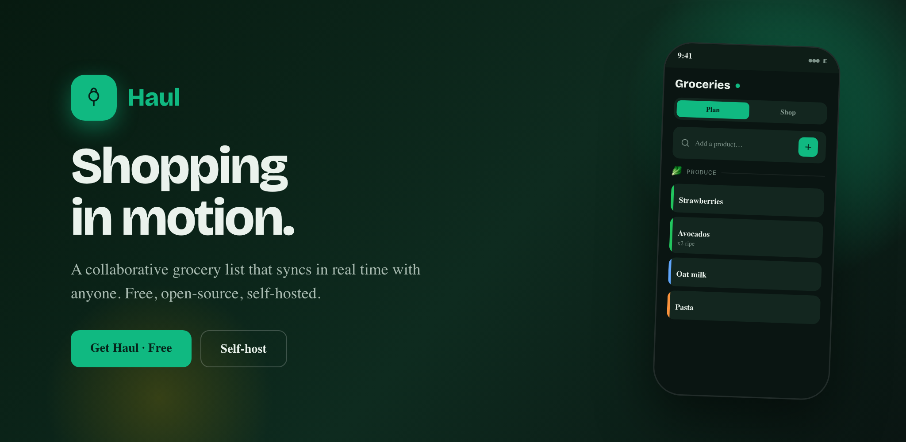
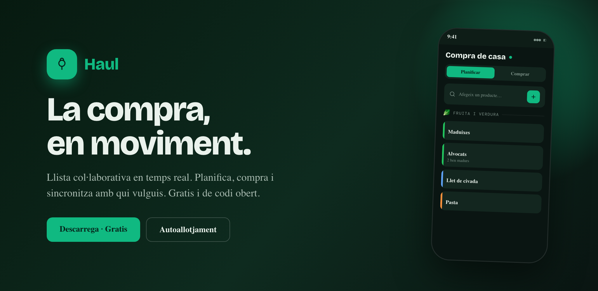
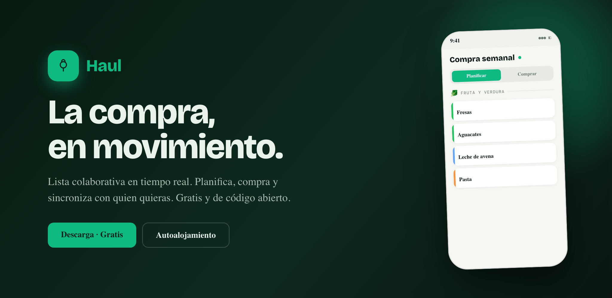

<div align="center">


# Haul

**Shopping in motion · La compra, en moviment · La compra, en movimiento**

[](https://github.com/borborborja/haul/releases)
[](https://github.com/borborborja/haul/actions/workflows/docker.yml)
[](https://github.com/borborborja/haul/actions/workflows/android.yml)



**English** · [Català](#-català) · [Castellano](#-castellano)

</div>

---

## 🇬🇧 English

**A collaborative grocery list that syncs in real time with anyone. Free, open-source, self-hosted.**

Haul is one product across three clients sharing a single backend: a responsive **web app** (desktop + mobile, installable as a PWA), a **native Android app**, and a **Go + PocketBase** server with real-time sync.

### Features
- **Plan & Shop modes** — organise by category, then check items off with a live progress ring.
- **Real-time collaboration** — share a list with a code; everyone syncs instantly.
- **Multi-list** — keep separate lists, switch in a tap.
- **Offline-first** — works without signal; changes sync when you reconnect.
- **Views** — list, compact and grid; **auto-clean** of bought items.
- **Light & Dark** themes, three languages (CA / ES / EN).
- **Android home-screen widgets**, including a Shop-mode widget.

### Get it
- **Web / PWA:** run the Docker image (below) and open it in the browser → *Add to Home Screen* to install.
- **Android:** download the APK from the [latest release](https://github.com/borborborja/haul/releases/latest).
- **Docker:** `docker run -p 8090:8090 -v haul_data:/pb_data ghcr.io/borborborja/haul:latest`

---

## 🇨🇦 Català

<div align="center"></div>

**Llista col·laborativa en temps real. Planifica, compra i sincronitza amb qui vulguis. Gratis i de codi obert.**

Haul és un sol producte amb tres clients que comparteixen un backend: una **app web** responsive (escriptori + mòbil, instal·lable com a PWA), una **app nativa d'Android** i un servidor **Go + PocketBase** amb sincronització en temps real.

### Funcions
- **Modes Planificar i Comprar** — organitza per categories i marca els productes amb un anell de progrés en viu.
- **Col·laboració en temps real** — comparteix una llista amb un codi; tothom se sincronitza a l'instant.
- **Múltiples llistes** — llistes separades, canvi amb un toc.
- **Offline-first** — funciona sense cobertura; els canvis se sincronitzen en reconnectar.
- **Vistes** — llista, compacta i graella; **autoneteja** dels productes comprats.
- Temes **Clar i Fosc**, tres idiomes (CA / ES / EN).
- **Widgets** per a la pantalla d'inici d'Android, inclòs un widget de mode compra.

### Com obtenir-lo
- **Web / PWA:** executa la imatge Docker (a sota) i obre-la al navegador → *Afegir a la pantalla d'inici* per instal·lar-la.
- **Android:** descarrega l'APK des de l'[última versió](https://github.com/borborborja/haul/releases/latest).
- **Docker:** `docker run -p 8090:8090 -v haul_data:/pb_data ghcr.io/borborborja/haul:latest`

---

## 🇪🇸 Castellano

<div align="center"></div>

**Lista colaborativa en tiempo real. Planifica, compra y sincroniza con quien quieras. Gratis y de código abierto.**

Haul es un único producto con tres clientes que comparten un backend: una **app web** responsive (escritorio + móvil, instalable como PWA), una **app nativa de Android** y un servidor **Go + PocketBase** con sincronización en tiempo real.

### Funciones
- **Modos Planificar y Comprar** — organiza por categorías y marca los productos con un anillo de progreso en vivo.
- **Colaboración en tiempo real** — comparte una lista con un código; todos se sincronizan al instante.
- **Multilista** — listas separadas, cambio con un toque.
- **Offline-first** — funciona sin cobertura; los cambios se sincronizan al reconectar.
- **Vistas** — lista, compacta y cuadrícula; **autolimpieza** de lo comprado.
- Temas **Claro y Oscuro**, tres idiomas (CA / ES / EN).
- **Widgets** para la pantalla de inicio de Android, incluido un widget de modo compra.

### Cómo obtenerlo
- **Web / PWA:** ejecuta la imagen Docker (abajo) y ábrela en el navegador → *Añadir a pantalla de inicio* para instalarla.
- **Android:** descarga el APK desde la [última versión](https://github.com/borborborja/haul/releases/latest).
- **Docker:** `docker run -p 8090:8090 -v haul_data:/pb_data ghcr.io/borborborja/haul:latest`

---

## Monorepo

| Path        | What                                                                 |
|-------------|----------------------------------------------------------------------|
| `web/`      | React + Vite + Tailwind app (responsive desktop + mobile, PWA, Capacitor) |
| `android/`  | Native Kotlin + Jetpack Compose app (+ home-screen widgets)          |
| `backend/`  | Go + PocketBase server (REST + realtime SSE)                          |
| `assets/`   | Brand & store graphics (logo, feature graphics)                       |
| `DESIGN.md` | Shared Haul design tokens (fonts, palette, category accents, shapes)  |

## Develop

```bash
cd backend && go run . serve          # PocketBase backend
cd web && npm install && npm run dev  # web app
cd android && ./gradlew assembleDebug # native app (JDK 17 + Android SDK)
```

## CI / CD

- **Docker** → builds the all-in-one image and pushes to `ghcr.io/borborborja/haul` on `main` and `v*` tags.
- **Android APK** → builds the APK on `main`, `v*` tags and manual runs; attaches a signed APK to the GitHub Release on tags (add `KEYSTORE_BASE64` / `KEYSTORE_PASSWORD` / `KEY_ALIAS` / `KEY_PASSWORD` secrets).

Cut a release with `git tag vX.Y.Z && git push origin vX.Y.Z` → versioned image + APK-attached Release.
