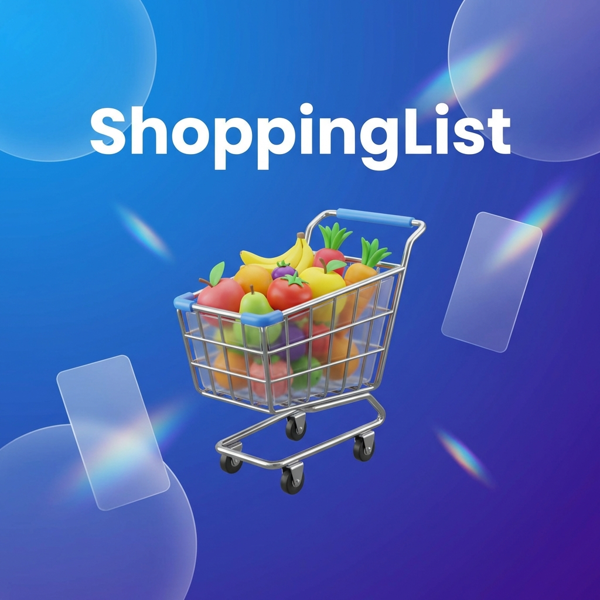

<p align="center">
  
</p>

# ShoppingList

> **v2 requires a clean installation.** The backend, authorization model and sharing flow were
> rebuilt for production. See [Production v2](docs/PRODUCTION.md) before deploying.

<p align="center">
  
  
  
  
</p>

<p align="center">
  <a href="./docs/en/README.md">🇬🇧 English Version</a> | 🇪🇸 <strong>Versión en Español</strong>
</p>

**ShoppingList** es una aplicación de lista de la compra moderna, auto-alojable y diseñada para la velocidad. Sincroniza en tiempo real entre todos los dispositivos de tu familia, funciona sin internet y ofrece una experiencia visual de primera clase.

---

## 📚 Documentación

Para obtener información detallada sobre partes específicas del proyecto, consulta los siguientes documentos:

*   🚀 **[Instalación](docs/es/SETUP.md)**: Guía paso a paso para configurar tu entorno de desarrollo y desplegar el servidor.
*   📱 **[App Web / PWA](docs/es/WEB.md)**: Características del cliente web, modo offline y sincronización.
*   👑 **[Panel de Administración](docs/es/ADMIN.md)**: Cómo gestionar el catálogo, usuarios y ajustes del servidor.
*   🤖 **[Android App](docs/es/ANDROID.md)**: Proceso de compilación, firma y publicación en tiendas.
*   🏗️ **[Arquitectura](docs/es/ARCHITECTURE.md)**: Detalles técnicos sobre el stack, modelo de datos y flujo de información.
*   📖 **[API & Database](docs/es/API.md)**: La "Biblia" para desarrolladores externos que quieran conectar con el servidor.

---

## ✨ Características Principales

### 📱 Para los Usuarios
*   **Sincronización en Tiempo Real**: Los cambios aparecen instantáneamente en todos los dispositivos conectados.
*   **Modo Offline (PWA)**: Funciona perfectamente sin conexión. Los cambios se guardan y se sincronizan al volver a tener internet.
*   **Clasificación Inteligente**: Los productos se ordenan automáticamente por categorías (Frutería, Congelados, etc.) para optimizar tu ruta en el supermercado.
*   **Temas Visuales**:
    *   ☀️ **Claro**: Fresco y limpio.
    *   🌑 **Oscuro**: Elegante y cómodo para la vista.
    *   🖤 **AMOLED**: Negro puro para ahorrar batería en pantallas OLED.
    *   🤖 **Auto**: Se adapta a tu sistema.
*   **Multi-idioma**: Español 🇪🇸, Català 🏴 (Estelada/Senyera), English 🇬🇧.
*   **Apps Nativas**: Soporte para Android e iOS mediante Capacitor.

<p align="center">
  
  
  
</p>

### 👑 Panel de Administración (`/admin`)
Gestiona tu instancia con un potente panel de control integrado.

*   **📦 Gestión de Catálogo**:
    *   Crea, edita y elimina categorías con emojis personalizados y colores.
    *   Administra productos y sus traducciones.
    *   **Acciones en Lote**: Selecciona múltiples items para borrar u ocultar rápidamente.
*   **👥 Gestión de Usuarios (Beta)**:
    *   Controla quién está conectado a tu lista mediante el sistema de Presencia.
*   **🔒 Seguridad y Configuración**:
    *   Cambia el nombre del servidor.
    *   Cambia la contraseña de administrador.
    *   **Nuevo: Modo Backend-Only**: Desactiva la web pública con un click para usar el servidor solo como API para las apps móviles.
    *   **Importar/Exportar**: Copias de seguridad completas de tu catálogo en JSON.
*   **🔄 Actualizaciones**:
    *   Comprobador de versiones integrado: Te avisa si hay una nueva versión en GitHub.

<p align="center">
  
  
</p>

---

## 🚀 Despliegue Rápido

### Opción 1: Docker Hub (Recomendado)

La forma más fácil de empezar. Actualizado automáticamente con GitHub Actions.

```bash
# 1. Descarga el fichero docker-compose
curl -O https://raw.githubusercontent.com/bor_devs/shoppinglist/main/docker-compose.hub.yml

# 2. Arranca el servicio
docker-compose -f docker-compose.hub.yml up -d
```

### Opción 2: Compilar desde Código

Si prefieres construir tu propia imagen:

```bash
git clone https://github.com/bor_devs/shoppinglist.git
cd shoppinglist
docker-compose up -d --build
```

---

## 🛠 stack Tecnológico

Esta aplicación utiliza un stack moderno y eficiente:

*   **Backend**: [PocketBase](https://pocketbase.io/) (Go) - Base de datos en tiempo real, Auth y API en un solo binario.
*   **Frontend**: [React](https://reactjs.org/) + [Vite](https://vitejs.dev/) - Rápido y reactivo.
*   **Estilos**: [TailwindCSS](https://tailwindcss.com/) - Diseño moderno y responsive.
*   **Móvil**: [Capacitor](https://capacitorjs.com/) - Convierte la web en apps nativas de Android e iOS.
*   **Infraestructura**: Docker + GitHub Actions.

---

## ⚙️ Variables de Entorno

Puedes configurar estas variables en tu `docker-compose.yml`:

| Variable | Descripción | Valor por Defecto |
|----------|-------------|-------------------|
| `DATA_DIR` | Archivos de la BBDD | `/pb_data` |
| `SMTP_ENABLED` | Activar emails | `false` |
| `SMTP_HOST` | Servidor SMTP | - |
| `SMTP_PORT` | Puerto SMTP | `587` |
| `SMTP_USER` | Usuario SMTP | - |
| `SMTP_PASSWORD` | Contraseña SMTP | - |

---

## 📄 Licencia

Este proyecto está bajo la licencia [MIT](LICENSE). Siéntete libre de forkearlo, modificarlo y usarlo.

---
<p align="center">
  <sub>Hecho con ❤️ y mucha cafeína.</sub>
</p>
